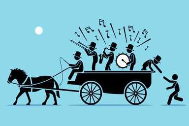
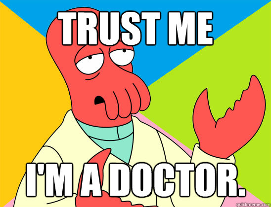

# Expanding the inquiry through critical thinking : using evidence, evaluation & findings.

## What is critical thinking?
- Generally, critical thinking is considered as the ability to think clearly and rationally about what to do and what to believe.
- Includes the ability to engage in reflective and independent thinking.
- Understand the logical connection between ideas.
- Identify, construct, and evaluate arguments.
- Solve problems systematically.
- Identify the relevance and importance of ideas.
- Reflect on the justification of one's own beliefs and ideas.

> <a href="http://www.forestdss.org/wiki/index.php?title=Simon%27s_decision_making_model" target="_blank">Simon's model of decision making</a>

> "Immediate acceptance of an idea that suggests itself as a solution to a problem (e.g., a possible explanation of an event or phenomenon, an action that seems likely to produce a desired result) is "Uncritical thinking", the minimum of reflection" (Dewey 1910:13)"

# The Bandwagon Fallacy

> source : <a href="https://assets.ltkcontent.com/images/15334/30724.jumping-on-bandwagon_0066f46bde.jpg" target="_blank">Bandwagon Fallacy</a>

### What do you see in this picture

> Me 
> - Some people are enjoying to do their work and few peoples are following them.

> By my friends:
> 
> <a href="https://sites.google.com/view/debarghya-d/home" target="_blank"><u>Debarghya Dev</u></a>
> 
> A loud propaganda, which like convinces a large mass of people to believe something.
> 
> <a href="https://sites.google.com/view/aman007/home" target="_blank">Aman Kumar Sheoran</a> : What if he really wants to join the band?
> If the person really wants to join and thought of it then it is not a Bandwagon Fallacy.

### The Appeal to Authority Fallacy

> source : <a href="http://www.quickmeme.com/img/a6/a6284ddbf04f9a378c36ec483909b1e06e05287a0d092f2ae2540c4dab33b21e.jpg" target="_blank">Trust Me I'm A Doctor</a>

- Making use of authority to speak the falsely statement.

Example:

**A commercial claims that a specific brand of cereal is the best way to start the day because athlete Michael Jordan says that it is what he eats every day for breakfast.**

### The Hasty Generalization Fallacy

> source : <a href="https://1.bp.blogspot.com/-TyN-YxkXtWA/T9YXoGpYVWI/AAAAAAAAAAo/KPK1uDPOL8g/s1600/00.PNG" target="_blank">Hasty Generalization Fallacy</a>

In this fallacy a person arrive to conclusion without providing enough supporting evidence to the respective topic.

> - You cannot arrive a conclusion only on basis of one or two evidence.

## Sync Activities
Activities : [[sync-activities3]]

## Asynchronous
Async : [[async-23-10-2021]]