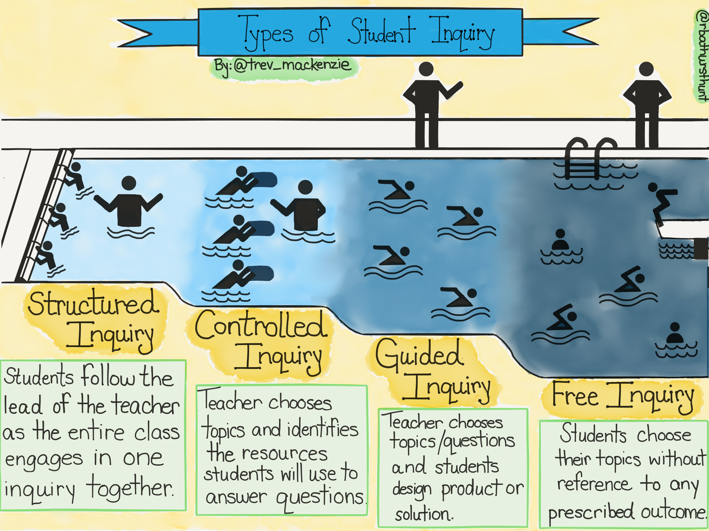
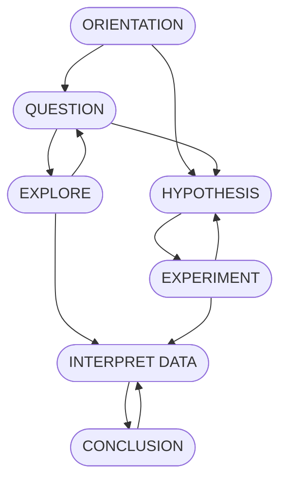

# SActivities-IV

## Activity-1 : What do you see in the picture of `Types of Student Inquiry`.

 Source : <a href="https://www.learningpersonalized.com/wp-content/uploads/2016/12/Types-of-Student-Inquiry-Illustration.png" target="_blank">Types of Student Inquiry</a>   
 
 1. Structured Inquiry
 2. Controlled Inquiry
 3. Guided Inquiry
 4. Free | Open Inquiry

### Structured Inquiry

> By Me,
> - Students are beginners so in swimming they are following whatever the teacher say.

> By my friend:
> 
> <a href="https://www.snehilsaini.com/about-7" target="_blank"><u>Snehil Saini</u></a>
> 
> Everyone are new in swimming they don't have much question so they are following what the coaching is trying to tell them.

### Controlled | Limited | Confirmation Inquiry

> By Me,
> - Student have progressed a little and using tools to improve more.

> By my friends,
> <a href="https://sites.google.com/view/saahils-portfolio/about-me" target="_blank"><u>Saahil Singh Rathore</u></a>
> 
> It show their progression

### Guided Inquiry

> By Me,
> - Student have progressed using tools and they left the tools which was support for them at first and now they are trying free style as the teacher guide them from outside the pool.

### Free | Open Inquiry

> By Me,
	> - Student are free to do their own things like exploring the new techniques.

## Activity-2 : Watch the video "What is Inquiry-Based Learning?" and give a example.

<iframe width="560" height="315" src="https://www.youtube.com/embed/QlwkerwaV2E" title="YouTube video player" frameborder="0" allow="accelerometer; autoplay; clipboard-write; encrypted-media; gyroscope; picture-in-picture" allowfullscreen></iframe>

- Inquiry-Based Learning existed for thousand of years.
- It is the critical component to the scientific method.

### Four Phases of Inquiry
> Pedaste, ET. All (2015)

#### Phase-1 : Orientation
Form of discussion. It where we become aware of key idea.

#### Phase-2 : Conceptualization
- Student generate  `Question`.
- Student define a `Hypothesis`.

#### Phase-3 : Investigation
- Where student :
	- Explore.
	- Experiment.
	- Interpret data.

#### Phase-4 : Conclusion
Student conclude their work.
	

### Examples on any inquiry

**Open | Free Inquiry** : 
- Research a topic which you chosen it.
	- Read articles to know the topic and understand it.
	- Implement and document what you learned.