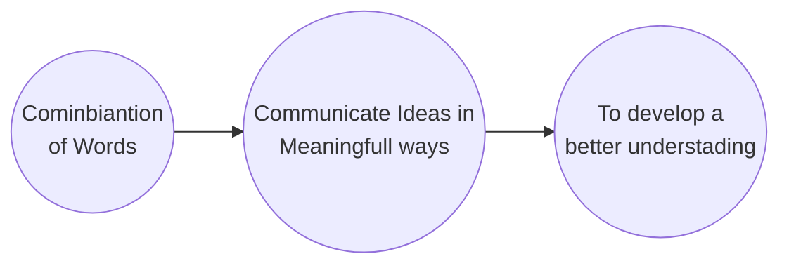
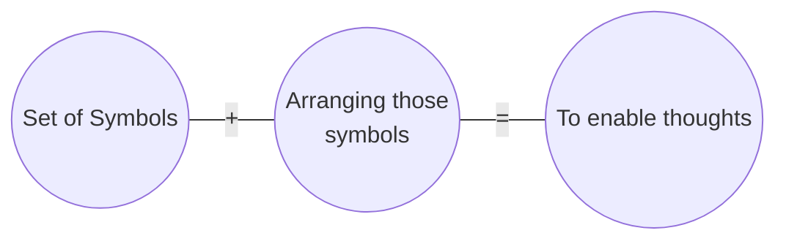
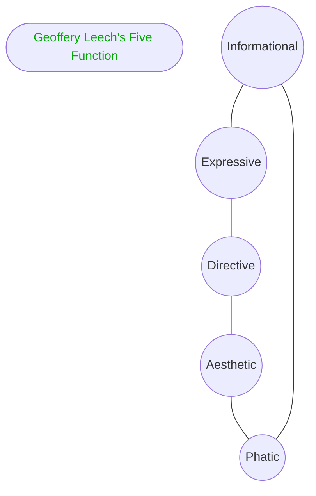

 <h1 align="center">Language &amp; Thoughts</h1>

Introducing Language  as an Important Tool for learning Process

> &#8220; Language is the dress of thought &#8221;
> 
 &#10147; <a href="https://digital-gardenx.netlify.app/connoisseurs/writer/samuel_johnson">Samuel Johnson</a>

> &#8220; Without language, thought is a vague, uncharted nebula. &#8221;
> 
 &#10147; <a href="https://digital-gardenx.netlify.app/connoisseurs/Linguistics/Ferdinand_de_Saussure">Ferdinand de Saussure</a>

## Language

The Encyclopedia Britannica Vol.13 defines language as:

"A system of conventional spoken or written symbols by means of which human beings, as members of a social group and participants in its culture, communicate."

## Language & Thoughts

Language is not only the vehicle of thoughts, its is a great and efficient instrument in thinking.

## Five Functions of Language

