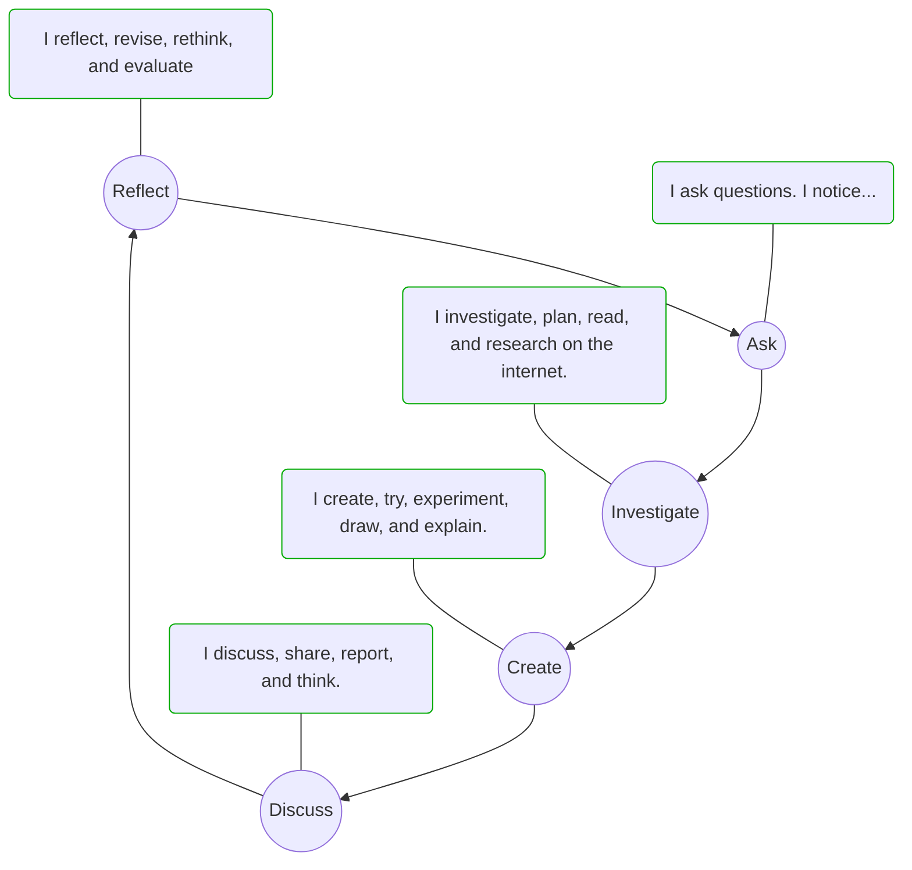

# Learning Through Inquiry
## What is mean by Inquiry?

> By Me :
> Seeking the information through questioning.

> By my friend:
> - Chitwan Singh : Asking for information.
> - Snehil Saini : Learning through question about thing that we don't know.

## What is Inquiry Based?

> By my friend,  
> - Debhargya Dev :  Why the arrow point from `Reflect` to `Ask` once the cycle completed?
> - Sometime a reflect give you a another quiry.

## Sync Activities

Activities : [[sync-activities2]]

## Asynchronous
