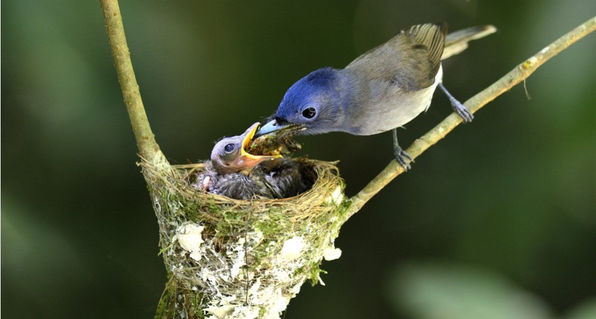

# SActivities-II

## Activity-1 : Have a look at this picture :

> Source : [Black Naped Monarch Bird](https://www.ngenespanol.com/wp-content/uploads/2018/08/%C2%BFLos-nidos-son-s%C3%B3lo-para-tener-polluelos.jpg)

*Asssumption : Below first two question are answered assuming that the feeding bird is a mother.

1. What do you see?
	- A mother bird feeding her child.

2. What do you understand?
	- Mother bird worked very hard to get that food, so that she can feed her child.

3. What do you wonder?
	1. Is the child Boy or Girl?
	2. Feeding bird is a mother or father?
	3. On which tree they build the nest?

> By my friends,
> - Debhargya Dev : 
> 1. What do you see?
> Mother bird feeding her child.
> 2. What do you understand?
> Is show her motherhood.
> 3. What do you wonder?
> From where did she get the food from.