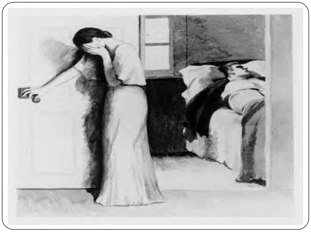

# Picture Perception Test

  
	
Description

	 <ul>
		 <li>Providing students a few picture and let them choose one picture and write a story based on one’s perception.</li>
		<li>Applying mind-mapping technique, creativity, critical thinking skills.</li>
	</ul>

 

---

Source: <a href="https://image.slidesharecdn.com/standarizedtests-121230001331-phpapp01/95/standarized-tools-9-638.jpg?cb=1356826549" target="_blank">Picture PT</a>

<h2 align="center" style="color:"><u>Title</u>: The Time</h2>

<h4 align="center">What! the CEO of TechX company is dead and his last words are...</h4>

Aman Khan and Khushi Khan both married in the year 2022. They both were happy. Aman Khan was the owner of a small tech company which is called `TechX` this company produce the material part for smartphones and deliver them. And Khushi was a housewife. They gave birth to the boy child, day 16 Feb 2023. They celebrated his birth with a grand party along with his office workers.

Aman Khan was very close to the workers he always thinks of them as family. His nature toward them was like a friend.

All was going good till the day 24 March 2023. When Aman falls while explaining the plan of the next product to his assistant Raju Rangolia. Raju harried and took him to the nearest hospital to the office. Raju called Aman's wife to the hospital. When the dr. Rama Swamy finished his checkup he told Raju to take Aman to a
Pancreatic cancer specialist and Aman was transported to  "Shivaji"  Hospital their Raju and Khushi talked to Dr Zaid is was the Pancreatic cancer specialist after treating Aman he when to his cabin and called to Raju and said that Aman has max 14 months left he is in the serious stage. Dr Zaid said that Aman might not notice the symptoms and signs. Raju asked Dr Zaid that is it good the tell Aman of his condition. Dr Zaid replied to him that let him relax for a week then bring him back to me, after he gets conscious he can be discharged for now. When Aman got conscious he was discharged. And he was taken to his home he rested for a week and then Raju took him to Dr Zaid. Dr Zaid explains to him the condition he is in. After hearing what Dr Zaid said, he became sad that what will happen to his family, his company and his company worker.

From the next day onward he worked hard. To build the new product that he was discussing with Raju. After 3 months he launched the product and that was a Smartphone will all the feature. When it was launched it become famous many people were buying the phone. Next, he launched the phone worldwide due to its popularity many contractors were contacting him. After 2 and a half month later his company branches was worldwide.

His company share prices were always high. Even if it drop it was only by two to three in number. He always was very interested in BCI (Brain-Computer Interface), he created a tech and scientist team to work on a project called "BrainX".
Which was to build an Invasive Brain-computer Interface which was easy to implant and easy to remove and from which a person can control a robot hand, leg or even can use a computer from his brain. He word hard with his team sometimes thing goes wrong and a lot of his money was invested in it. He got failure after failure but the project was not worked out. But he didn't give up even the project manager said to stop the project. Now after 11 months the project was a success. 

He noticed that Dr Zaid said time passed but still he was alive.

After the project was completed. He announced that the project will be launched worldwide after 2 months. After 4 days of the announcement, his symptoms start showing and he was hospitalized. After his temporary treatment. He requests Dr Zaid to shift him to his house. Before starting the BrainX company Aman bought a small house near his home town. He was shifted to his townhouse with all the equipment and a nurse. His wife and child were also with him. He was always lying on the bed. One day while he and his wife both were talking to each other. His symptoms were gone worse the nurse was doing her best to make him normal, she went outside to call the doctor. At that time Aman called his wife and said to her with a smile on his face "Don't worry I've no regrets".

Meantime, his son was playing in the living room to see his parent he came to the room where Aman was lying. Khushi heard the walking of her son and ran toward the door to close. So that her son cannot see that she is crying, because she knows that when she cries, her son will cry too, which will make him ill. Standing at the door she was crying with little to no voice.

And this is how a great businessman died by saying "I've no regrets".

After his burial,
His wife Khushi became the CEO of both companies which was written in Aman will and launched the BrainX as his husband announced.
