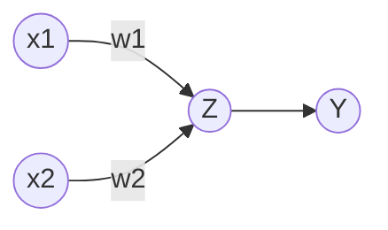

# Basics of Machine Learning Journey

---

## Introduction
What is Deep Learning?

Extract patterns from data using `Neural Networks`

What are Neural Networks?

Neural Network is network of neuron or node or `perceptrons`. which is used in deep learning to create a deep learning layers.

What is Machine Learning?

It is turning data into numbers and finding patterns in those numbers.

<u>or</u>

Ability to learn without explicitly being programmed.

- Finding patterns is done by computer by code and Mathematics.

Machine Learning vs. Deep Learning

Deep Learning is the sub filed of Machine Learning.

![[taxonomy_of_ai_ds.png]]

source: <a href="https://miro.medium.com/max/1050/1*24Hj2PgyawR20kJBj8NU0g.png" target="_blank">The Taxonomy of Artificial Intelligence and Data Science</a>

---
	
## Concepts
	
What is the difference between `Traditional Programming` and `Machine Learning Algorithms`?
	
- Traditional Programming
	- In traditional programming we start with `input data` and `rules` and create the `output`.
- Machine Learning Algorithms
	- We start with how input looks like and how an ideal outputs look likes and let the machine learning model figures out the rules.
	
- Why use deep learning?
	- Reason: For a complex problems, can you think of all the rules?
	- When not to use machine learning?
		- If you can build a `simple rule-based` system that doesn't require machine learning, do that.
	
- What deep learning is good for?
	- Problems with long lists of rules: 
		- When the traditional approach fails, machine learning/deep learning may help.
	- Continually changing environments:
		- Deep learning can adapt ("learn") to new scenarios.
	- Discovering insights within large collections of data:
		- can you imagine trying to hand-craft rules for what 101 different kinds of food look like?

- What deep learning is not good for (typically)
	- When you need explainability:
		- The patterns learned by a deep learning model are typically uninterpretable by a human.
	- When the traditional approach is a better option:
		- If you can accomplish what you need with a simple ruled-based system.
	- When errors are unacceptable:
		- Since the outputs of deep learning model aren't always predictable.
	- When you don't have much data:
		- Deep learning models usually require a fairly large amount of data to produce great results.
	- Usually, Machine learning gives good result for `Structured Data` and Deep learning gives good result for `Unstructured Data`.

- Structured Data
	- Data which has a common pattern.
	- Example:
		- CSV (comma separated value).
		- Excel sheet.
- Unstructured Data
	- Data which are not organized
	- Example:
		- Video
		- Audio
		- Real-time data

- Algorithms or Techniques used for `Structured Data` and `Unstructured Data`.

	- Structured Data
		- Random Forest.
		- Naive Bayes.
		- Nearest neighbour.
		- Support Vector Machine.
		- ...many more.
	
	- Unstructured Data
		- Neural Networks.
		- Fully connected neural network.
		- Convolutional Neural Network.
		- Recurrent neural network.
		- Transformer.
		- ...many more.
	
- It depends on the problems to use the algorithms some times we can use both sides algorithms.
	
### The Perceptron
	
Simple Neural Network
	

	
Here,
- `x's` are the input perceptron.
- `w's` are the weights.
- `Z` is the Hidden layer.
- `Y` is the output layer.
	
Mathematically,
- $$ Z=w_{0} + \sum_{j=1}^{m}x_{j}w_{j} $$
	- $w_{0}$ is bias, it allow us to shift activation function left or right.
- Non-Linear activation function
	- $$g(w_{0} + \sum_{i=1}^{m}x_{i}w_{i})$$
	- All activation function are non linear.
- $$Y(output) = g(w_{0} + \sum_{i=1}^{m}x_{i}w_{i})$$
	
	
## Learning Curves

Machine learning is an interesting and new topic to me. I always wondered about how machine algorithms is used to create a machine learning model that do the work without explicitly programmed.

So, I start exploring thing like google and watching youtube video to clear the doubts that I had regarding machine learning.

Then I come across a video lecture where I learned the correct meaning of machine learning and difference in Machine Learning, Deep Learning, Artificial Intelligence and Data Scientists.

##### Learning OutComes

- I learned about,
    - What is Deep Learning?
      - How to create a Deep learning Neural Networks?
      - Library used to create Deep Learning?
    - What is Machine Learning?
      - For what Purpose we use Machine Learning.
    - What are Neural Networks?
      - What are nodes | Perceptrons?
      - Biases.
      - What are features or Patterns?
      - Non-Linear Activation Function.
      	- Rectified Linear Unit (ReLU).
	  	- Neural Network Layers.
			- Input layers
			- Hidden Layers
			- Output Layers.
		- Single Layer Neural Network.
		- Dense Layer Neural Network.

While learning there were a time were I cannot manage my time to go through the lecture so I used the `Pomodoro Technique` in which I focus for 50min for learning and take breaks for 10min. Recalling the previous lecture was one of my problem so I used the `Feynman Technique` and `space repetitions` to overcome this thing.
	
While learning I came across a doubt that `If I'm able to write the code to create a machine learning model, how can I make it publish as a post?`

To this I googled and find out the open source project in `Github` called `FastPages`. which convert the Jupyter notebooks into a blog page and publish the page using `github actions`.
	
- Late, but still I have written some theory and in future I'll be writing the machine learning code in my `LabGarden`.
	
	- Link: <a href="https://adam-al-rahman.github.io/LabGarden/" target="_blank">LabGarden</a>
	- Url: `https://adam-al-rahman.github.io/LabGarden/`
	
Learning Machine Learning is good, but to use machine learning correctly is the point. To this I google it and find out the `Google Machine Learning Handbook`.
- Link: <a href="https://developers.google.com/machine-learning/guides/rules-of-ml" target="_blank">Google Machine Learning Handbook</a>.

---

## Conclusion
	
Machine learning is a vast topics to cover, as I've only scratch the surface of it. But known the few thing, I'll be learning more on it in future.
	
> I believe ML(Machine Learning) and DL(Deep Learning) will be the future of the Robotics (Sophia as example) and data scientist and trying to predict the future outcomes.

---
	
## Tools used while learning

<a href="https://code.visualstudio.com/" target="_blank">Vscode</a> (Visual Studio Code): As editor.
Jupyter Notebook : For running machine learning | python code.
<a href="https://www.anaconda.com/" target="_blank">Anaconda</a>: A large group of python's libraries for Data Science.
Conda : Anaconda's package manager.
Python : As programming language.
Pip : Python's package manager.
Vim binding : <a href="https://www.vim.org/" target="_blank">Vim Editor</a> keyboard commands that do specific things in the editor.

<a href="https://code.visualstudio.com/docs/datascience/jupyter-notebooks" target="_blank"> Jupyter Notebook in VScode</a>.

