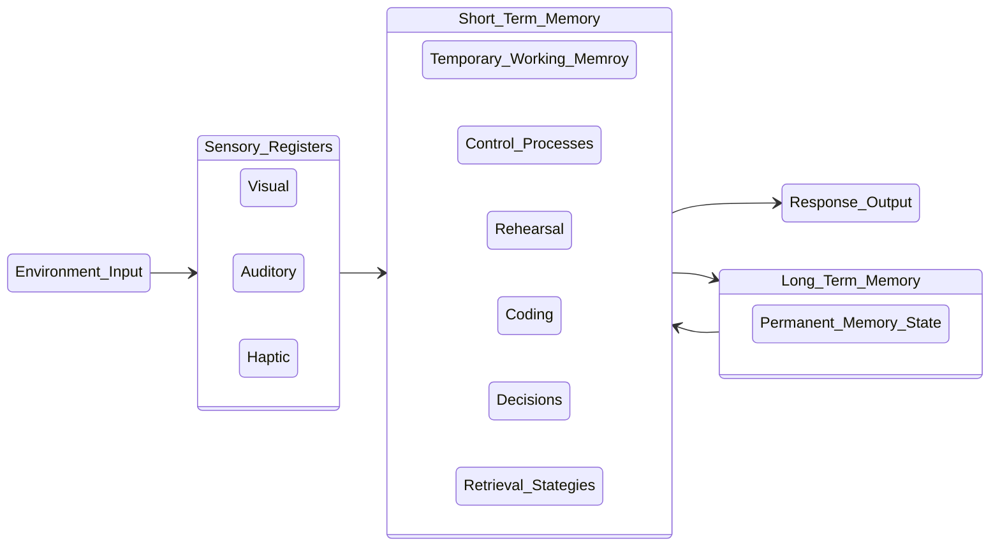

# Learning Process

> `Alvin Toffler` rightly said that the illiterate of the 21st century will not be those who cannot `Learn`, `Unlearn` & `Relearn`.

## The learning process : Attention & Memory.

- Six interactive components of the learning process
	- Attention.
	- Memory.
	- Language.
	- Processing & Organizing.
	- Graphomotor (Writing) and
	- Higher order thinking.

These processes interact not only with each other, but also with `emotions`, `classroom climate`, `behavior`, `social skills`, `teachers` and `family`.

### Attention

Paying attention is the first step in learning.

- Easy to pay attention : Interesting or exciting to us.
- Difficult for most of us to pay attention to things that are not interesting and exciting to us.

Q : What do you thing on the above `Attension` saying?

<u>Answer by <a href="https://atiq-ur-rehaman.netlify.app/#about" target="_blank">Me</a></u>,

> Paying attention while learning thing can get difficult if we are not interest in it.

<u>Answer by my friends</u>,

 > <a href="https://sites.google.com/view/aanchaltailwal/home" target="_blank"><u>Aanchal Tailwal</u></a>
 > 
> It is easy to pay attention if we feel that the particular thing is interesting to us. But if it is not we automatically starts getting away from it.

### Memory

- A complex process.
- Uses three systems to help a person receive, use, store, and retrieve information

#### The three memory systems are

1. Sensory memory.
2. Short-term memory and
3. Long-term memory.

#### Graph View

### Self Management Skill

Psychologist <a href="https://en.wikipedia.org/wiki/Robert_Sternberg" target="_blank">Robert Sternberg</a> list six components of mental self-management.

1. Know your strengths and weaknesses.
2. Capitalize on your strengths and compensate for your weakness.
3. Defy negative expectations.
4. Believe in yourself (self-efficacy).
5. Seek out role models.
6. Seek out an environment where you can make a difference.

## Discussion of Group activity

### Activity : Preparing a slide show of `Celebrating Diwali Break`.

#### Rules

- First slide.
- Each member one slide.
- Last slide + Screenshot or recording of group meeting.
- Group Leader as the presenter.
- Date of presentation is on `26 November 20221`.

## Sync-Activities
Activities : [[sync-activities5]]

## Asynchronous

Async : [[async-12-11-2021]]