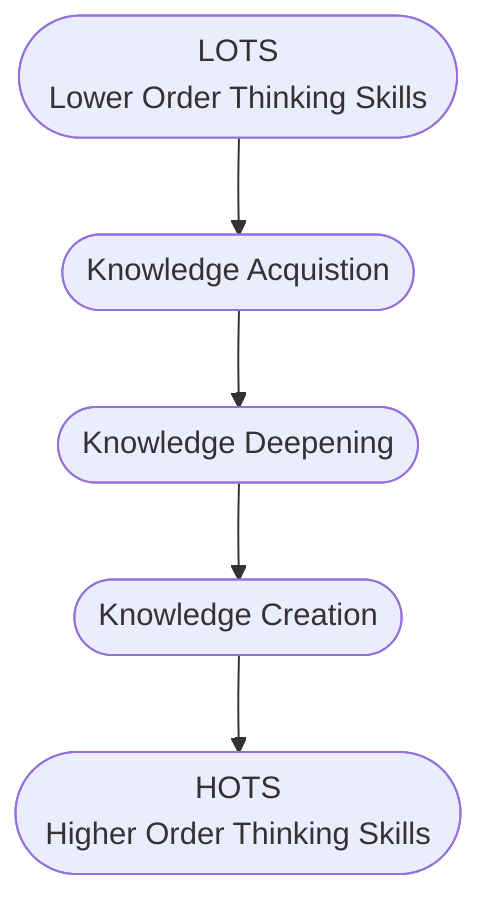

# Interactive Component of Learning Process

## Higher Order Thinking Skills

- Ability to acquire and improve cognitive skills
-  Cognitive Skill
	-  Core Skills used by brain to think, read, learn, remember, reason and pay attention.
	-  Weakness in any of these skill can lead to learning struggles.
	-  Attention : Lets stay focused
	-  Memory : Recall past information.
	-  Reason : Enables to reason, form ideas, solve problems.
	-  Auditory | Visual processing : Analyze and segment sounds|images
		-  Example : Answering telephone involves.
	-  Perception (hearing ring tone)
		-  Decision (answer or not)
		-  Motor Skill (lifting receiver)
		-  Language Skill (talking and understanding)
		-  Social Skills (Interpreting tone of voice)
	-  Going beyond "Memorizing the facts and information"

## Bloom's Taxonomy

Source: <a href="https://educationaltechnology.net/wp-content/uploads/2020/12/Blooms-Taxonomy.png" target="_blank">Bloom's Taxonomy</a>

 

> Using Bloom's Taxonomy of thinking skills, the goal is to move from lower to higher-order thinking.

