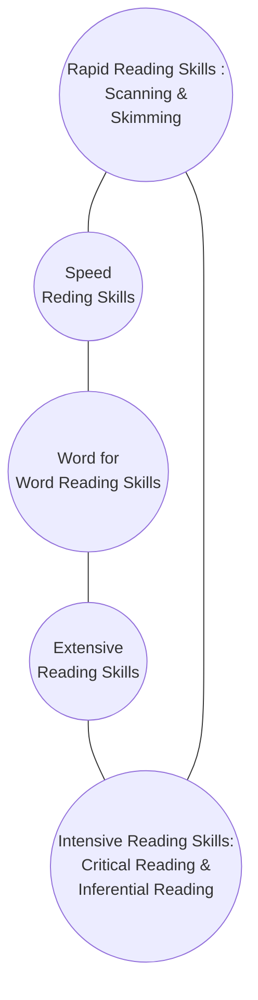

# Learning Tools - Basic tools that help Learning

## Reading And Writing

> &#8220; Reading make a full man, conference a ready man, and writing an exact man. &#8221;
> 
 &#10147; <a href="https://digital-gardenx.netlify.app/connoisseurs/philosophers/Francis_Bacon">Francis Bacon</a>

## Reading Skills:

Language skills are an important tool in communication, listening, speaking, reading and writing aid in not only improving language skill but also in making communication effective

- The essential characteristic of reading skills:
	- Firstly, comprehension is the ability to understand.
	- Secondly, the speed at which one can read.

## Types of Readings

