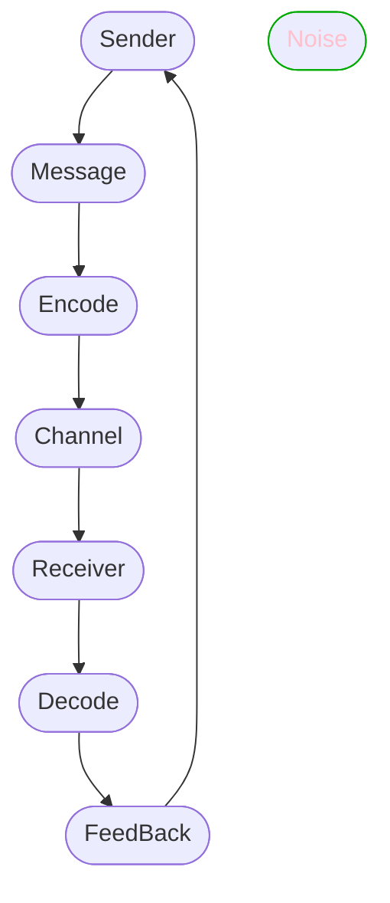

# LC-Activities-II

## Activity-1 : Watch Video Communication Cycle 

<iframe width="560" height="315" src="https://www.youtube.com/embed/4Z1BIeje_ko" title="YouTube video player" frameborder="0" allow="accelerometer; autoplay; clipboard-write; encrypted-media; gyroscope; picture-in-picture" allowfullscreen></iframe>

### The Eight Component of Communication

1. Sender.
2. Message.
3. Encode.
4. Channel | Medium.
5. Receiver
6. Decode.
7. FeedBack | Response
8. Noise

### How does an idea get from the `sender` to the `receiver`?

The idea represent the third component in the communication cycle. i.e, `Message`.

- Next the message is `Encoded`, and it can be
	- Verbal.
	- Non-Verbal.
	- Both.

- After encoding the message has to pass through a medium also called `Channel`. Which is our fourth component. 
	- The channels are our `five sense`.

- When the message is received by receiver, the receiver need to `Decode` it, to understand the message .
- After the message is decode by receiver, the receiver need to `Response` to the sender that is also called `FeedBack` which is our seventh component.
- In the above process anything that complicate the message or the feedback is called `Noise`.

## Communication Cycle

