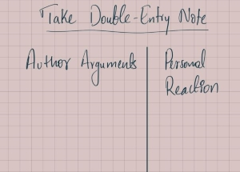

# Preparing for an Academic Discussion

## Which house will be better the house with strong foundation or a house with no foundation at all?
- Obviously it's the house with a strong foundation.

> Building a strong foundation for something is called `Laying the Groundwork`.

- Academic discussion are same to the houses, we have to lay the groundwork too.

## What the ground work in an `Academic Discussion`?
- Pre-Dicussion preparation. If you don't prepare you dicussion will be disaster.

## Ways to prepare for an Academic Discussion
### Read Actively 

- Pre-Dicussion Reading Strategies
	1. Mark the text.
	2. Take double-entry notes.
	3. Note key vocabulary.
	4. Make lists.

1. Mark the text
	- Just don't read the text, along with reading think and react to the text. Like making a `check points`.
		- &#10004; : Agree | I like it.
		- X :  Disagree | I don't like it.
		- ! : New, surprising, memorable.
		- * : Important point to discuss.
		- ? : Question.
		- # : Contradicts Expectations.
2. Take Double-Entry Notes
	- On a page draw a line at center and in left side write `Author Aurgument`  & right side write `Personal Reaction`.
	- 
	- Maintain a proper indented point that the author says.
3. Note key vocabulary.
	- Note the key word.
	- Know the meaning of the word.
	- Learn the proper pronunciation of that word.
	- If you wanna perfect the word use the word in your example.
4. Make Lists.
	- Make a short list of thing that you wanna say or want to ask.
	- Make a list of question that you wanna ask.

	> Be open minded, if some one change the point that you make, note it down and search on it.

> " By failing to prepare, you are preparing to fail. "
> &nbsp; Benjamin Franklin.