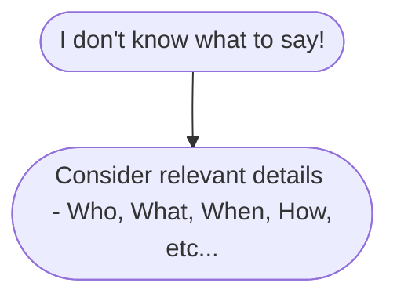

# Informal Speaking

## Successful Group Work

Learning in working group is an important skill in university classes and also in your future career.

### Advantages of group work

- Good training for the future.
- Put everone's strengths together.
- Divide up the tasks.
- Get to know your classmates betters.

### But group work isn't always easy

- You can't always do it your way.
- Communication and coordination can be tricky.
- Group work can take a lot of time.
- You have to rely on others.

### How can we make it go more smoothly?

It requires,
- Collaboration.
- Equal commitment.
- Good communication.
- Clear roles.
- Break the work up.
- Set goals and a timeline.
- Don't procrastinate.
- Support and encourage each other.
- Everyone needs to be heard.

### But what if

#### Someone doesn't want to participate?

- One step at a time.
- You don't have to be perfect.

#### If you want to encourage someone

You can say,

- And what do you think?
- Do you have something to add?
- We'd like to hear your ideas.

#### Someone participates `too much` or talks too much?

You can say to that person,

- We appreciate your ideas, but let's hear from everyone.
- Let's make sure we hear everybody's ideas.
- You can a different person of his/her ideas, by saying,
	- And what do you think?

### Another strategy

- Let's take a few minutes to think, and then we can all give our ideas.
- Let's brainstorm and hear all the ideas before we decide what to do.

### And what if you disagree?

- Listen carefully.
- Be open to others' ideas.

#### Ask questions to find out more
 
 Like,
 - I hear you saying that..
 - Is that correct?
 - Did I understand your point?

### Yes, but...

- That's a good point, but I think...
-  I see your point, but don't you think that...
-  I agree, but we also need to look at....
-  I see what you mean, but how about...

### Cultural and language differences

- Be aware of expectations.
- Don't be judgmental.
- Assume good intent.
- Talk about it.

### Be ready to learn

## Small Talk

### Small talk seems easy.

- It builds good feelings with others.

### What do you talk about?

The most frequent topic,
- Weather
	- Nice weather today, isn't it?
	- It looks like it might rain.
- The speakers' jobs
	- What do you do for living?
- Sports
	- Did you see the Dhoni's game yesterday?
- Hobbies and interests
	- What do you like to do in your spare time?
- Things around you
	- Do you know any good restaurants near here?
- Transportation & traffic
	- Did you have a hard time finding this place?
- Plans
	- Do you have any plans for the weekend?
- Entertainment
	- Have you seen any good movies lately?

### Topics to avoid

Question like,

- How old are you?
- Are you married?
- How much money do you make?
- Money & income.
- Age.
- Politics.
- Religion.
- Health problems.
- Death.
- Relationships, marital status.
- Sex.
- People's appearance.
- Gossip.
- Anything that might make people feel uncomfortable.

### Keep the conversation going
It can be challenge!

#### Ask follow-up questions

- I've just come back from a trip.
	- Oh? where did you go?
	- Was it business or a vacation?
	- What did you do there?
- I went to San Francisco last summer.
	- I've never been there. Tell me about it.

> Small talk: It really is a big thing.

## Impromptu Speaking

- Speaking with little to no preparation
	- Job
	- Class
	- Tests :TOEFL, IELTS

### Are you good at speaking impromptu?

With no practice if a person speak good

> Words just come to you naturally.

### Are you poor at speaking impromptu?

Following situation,

- You freeze up and words cannot come out of your mouth.
- You get tongue-tied.
- You ramble or keep repeating yourself.

### Impromptu Speaking Objectives

The objectives for you to:

1. Answer the question directly.
2. Provide organization to your answer.
3. Expand your answer with more details.
4. Talk continuously for 1.5 minutes.

#### Answer the question directly

- Stick to the main point!

Examples:
- What's your favorite holiday?
- Do you prefer to watch a movies in the theater or at home?

#### Provide organization to your answer

- List VS. Time order

##### Organization Style : List

- Look at your topic an think of a list of main points.
- Main points might be:
	- Reasons.
	- Parts of something.
	- Examples.
	- Types of things.

##### Organization Style : Time Order

- Use this style for:
	- Experiences.
	- Historical Event.
	- How somethings started | ended.
- Content:
	- first, next, last
	- past, now, future.

### Expand your answer wit more details.

Most common reason,
- Nervousness.
	- My mind just went blank.

### Speak continuously for 1.5 minutes.

- Minimize awkward pausing or hesitating.
	- Fillers: umm, uhh,...

#### Organization

- Your presentation had an introduction, a body, and a conclusion.
- You used transitions between your main points in the body.

#### Content

You answered the question directly and provided relevant details.

#### Accuracy

There were very few grammar mistakes, and they didn't interfere with understanding. You used vocabulary accurately and appropriately.

#### Pronunciation

Your pronunciation was clear and easy to understand. You used word stress, pauses, and intonation appropriately.

#### Verbal delivery

You spoke smoothly and naturally, without too many hesitations. Your speaking was not too fast and not too slow.

#### Time limit

You spoke for 1.5 minutes.