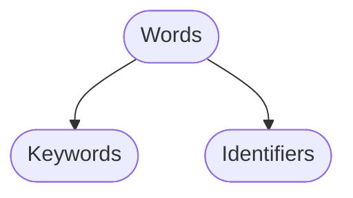
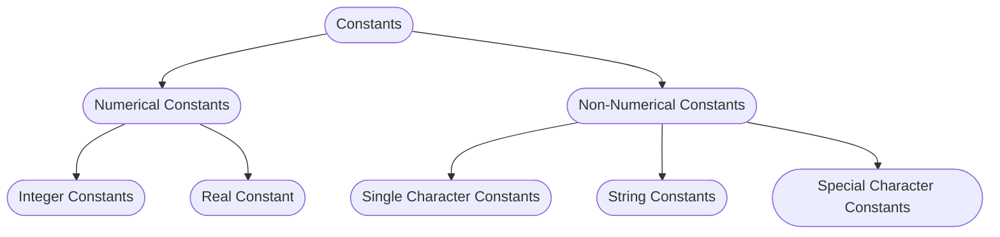
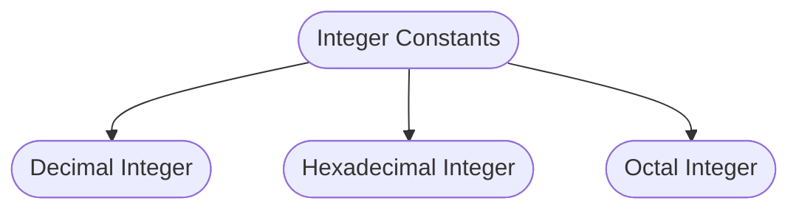
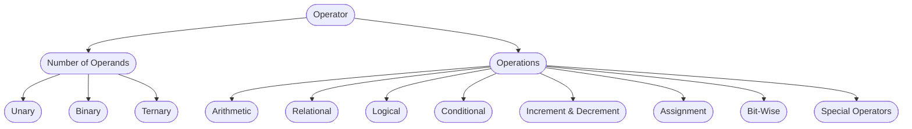

# C-Basic

## C Character Set

- Letters
	- Upper-case
	- Lower-case
- Digits
	- 0, 1, 2, 3, 4, 5, 6, 7, 8, 9.
- White Spaces
	- Horizontal tabs
	- Carriage Return
	- Blank space
	- New line.
	- They are not used in:
		- Keywords.
		- Identifiers.
- Special Characters
	- `;`, `.`, `,`, `+`, `{`, `[`...

## Tri-graph Sequence

There are curtain non-English keyword which does not support `Special Character`.

Does to entry this character `C` has `Tri-graph`

- Each trigraph sequence consist of `three character`
- Three Character
	- First two `?`
	- Follower by another character
	- `? ? character`

| Trigraph Sequence | Translation|
|:--:|:--:|
|??=|#|
|??(|\[|
|??)|]|
|??<|{|
|??>|}|
|??!|\||
|??/|\\|
|??-|~|

## C Tokens

The smallest individual unit of a program.

1. Keyword : `int`, `float`,..
2. Identifiers : `Aman`, `x`,...
3. Constants : 3, 3.4, 33,...
4. String : `"Hello world"`
	1. String's end with `null-operator`
5. Operator : `+`, `-`, `--`, `++`, `<`,....
6. Separator : `{}`, `[]`

### Keywords
Word are classified as

- Keywords
	- Has meaning and use.
	- Define by the developers of the language.
	- 32 keywords in c-lang.

### Identifiers

Identifiers are the   `names` given to anything(function, variable, array, memory_location, ...) for the purpose to identify them.

Naming convention

-   Can contain letters, numbers, and underscores.
-   Must begin with a letter or underscore(_)
    -   Cannot begin with a number.
-   Cannot use C-lang reserved keywords.
-   Cannot redeclare a name in the same scope (namespace)
    -   Remember that C-lang is case sensitive.
-   31 letter long can be the name.

#### Variable

It is a data name which is used to save values.

- They can take several value during program execution.
- Same naming rules as that of identifier.

### Constants

They are `unchanged during the program execution`.

#### Integer Constants

- Sequence of number

##### Decimal Integer
- Any combination of digit which consist of `0-9`.
- Has operator `+/-`
- Example :  `-33`, `3939`, `+333`

##### Hexadecimal Integer

These are those integer which are presided or prefix by `0x`
- They can also have alphabets in lower or upper i.e form A to F.
	- a, b, c, d, e, f.

|Character | Digit|
|:--:|:--:|
|A or a|10|
|B or b|11|
|C or c|12|
|D or d|13|
|E or e|14|
|F or f|15|

Examples :
- `0x45`, `0xA`,`0xb34`,`0x33Cb3`

##### Octal Integer

Any combination of digit which consist of `0-7`.

Example : 43, 03, 72

Wrong : 84 as 8 is not in the octal integer.

#### Real Constants | Floating-point number

Integer constant are in-efficient to represent quantities that are continuous in nature like

- Temperature.
- prices
- etc

To represent such quantities that has fractional part `float-point number` or `Real number` are used.

- These number are shown in `Decimal Notation`.

#### Single Character Constants

This consist of single character enclosed with a single quote.

Example : 'A', '5', ...

- Here, `'5' != 5`

|Character| Ascii|
|---|---|
|A|65|

#### String Constants

Sequence of character enclosed in double quotation.

Example : "a", "Hello World", ...

- Here, `'a' != "a"`

#### Special Character Constants | Escape Characters

`\` is used to output the symbol.

|Escape Character|Meaning|
|:--:|:--:|
|\n|New line character|
|\a|Audible alert(bell)|
|\0|Null|
|\b|back space|
|\f|form seed|
|\r|Carriage return|
|\\\ |BackSlash|
|\\'|Single quote|
|\\"|Double quote|
|\t|Horizontal tab|
|\?|Question mark|

### Separators

The are symbols which separate the code

- `[]`, `()`, `{}`, `;`, `:`, `*`, `...`, `=`, `#`

They have some special meaning, therefore, these are not used for other purpose.

- `{}` : mark start and end block of code.
- `()` : used to indicate function call and function parameter.
- `[]` : Used as array.

### Operators

> Expression = operands and operators

#### Operands

These are `variable | constants` on which operation are performed.

