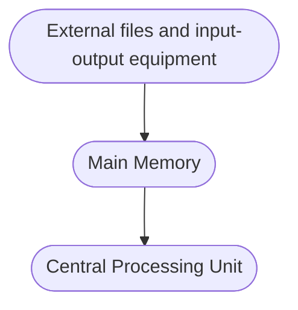

# PPL

## System Language

In 1960 `Christopher Strachey` developed `CPL (Combined Prgramming Language)` however CPL implemented very slowly in 1966 `Martin Richard` developed `BCPL ( Basic CPL)`

## Independent & Separate Compilation

- Independent Compilation : We can compile files in any order. it's `doesn't` affect the final output.
	- Languages : C, C++, Java,...

- Separate Compilation : Compilation should be done in proper order.
	- Files which define functions should be compiled first and then compile the file which call these function.
	- Language : Ada

## Compilation & Interpretation

- Compilation : All the file's code is read and then executed.
	- Languages: C/C++,...
- Interpretation : Line by line execution happens
	- Languages : python,...

## Impact of Machine Architecture on Programming Language

### Von Neumann Computer Architecture

Von Neumann architecture was first published by John von Neumann in 1945.

His computer architecture design consists of a Control Unit, [Arithmetic and Logic Unit](https://www.computerscience.gcse.guru/glossary/arithmetic-logic-unit) ([ALU](https://www.computerscience.gcse.guru/glossary/arithmetic-logic-unit)), Memory Unit, [Registers](https://www.computerscience.gcse.guru/glossary/register) and Inputs/Outputs.

Von Neumann architecture is based on the stored-program computer concept, where instruction data and program data are stored in the same memory.  This design is still used in most computers produced today.

### Central Processing Unit (CPU)

The [Central Processing Unit](https://www.computerscience.gcse.guru/glossary/central-processing-unit) ([CPU](https://www.computerscience.gcse.guru/glossary/central-processing-unit)) is the electronic circuit responsible for executing the instructions of a computer program.

It is sometimes referred to as the microprocessor or processor.

The CPU contains the ALU, CU and a variety of [registers](https://www.computerscience.gcse.guru/glossary/register).

#### Registers

Registers are high speed storage areas in the CPU.  All data must be stored in a [register](https://www.computerscience.gcse.guru/glossary/register) before it can be processed.

||||
|---|---|---|
|[MAR](https://www.computerscience.gcse.guru/glossary/memory-address-register)|[Memory Address Register](https://www.computerscience.gcse.guru/glossary/memory-address-register)|Holds the memory location of data that needs to be accessed.|
|[MDR](https://www.computerscience.gcse.guru/glossary/memory-data-register)|[Memory Data Register](https://www.computerscience.gcse.guru/glossary/memory-data-register)|Holds data that is being transferred to or from memory|
|[AC](https://www.computerscience.gcse.guru/glossary/accumulator)|[Accumulator](https://www.computerscience.gcse.guru/glossary/accumulator)|Where intermediate arithmetic and logic results are stored.|
|[PC](https://www.computerscience.gcse.guru/glossary/program-counter)|[Program Counter](https://www.computerscience.gcse.guru/glossary/program-counter)|Contains the address of the next instruction to be executed|
|[CIR](https://www.computerscience.gcse.guru/glossary/current-instruction-register)|[Current Instruction Register](https://www.computerscience.gcse.guru/glossary/current-instruction-register)|Contains the current instruction during processing|

#### Arithmetic and Logic Unit (ALU)

The ALU allows arithmetic (add, subtract etc) and logic (AND, OR, NOT etc) operations to be carried out.

#### Control Unit (CU)

The control unit controls the operation of the computer’s ALU, memory and input/[output devices](https://www.computerscience.gcse.guru/glossary/output-devices), telling them how to respond to the program instructions it has just read and interpreted from the memory unit.

The control unit also provides the timing and control signals required by other computer components.

### Buses

[Buses](https://www.computerscience.gcse.guru/glossary/bus) are the means by which data is transmitted from one part of a computer to another, connecting all major internal components to the CPU and memory.

A standard CPU system [bus](https://www.computerscience.gcse.guru/glossary/bus) is comprised of a [control bus](https://www.computerscience.gcse.guru/glossary/control-bus), [data bus](https://www.computerscience.gcse.guru/glossary/data-bus) and [address bus](https://www.computerscience.gcse.guru/glossary/address-bus).

|||
|---|---|
|[Address Bus](https://www.computerscience.gcse.guru/glossary/address-bus)|Carries the addresses of data (but not the data) between the processor and memory|
|[Data Bus](https://www.computerscience.gcse.guru/glossary/data-bus)|Carries data between the processor, the memory unit and the input/output devices|
|[Control Bus](https://www.computerscience.gcse.guru/glossary/control-bus)|Carries control signals/commands from the CPU (and status signals from other devices) in order to control and coordinate all the activities within the computer|

### Memory Unit

The memory unit consists of [RAM](https://www.computerscience.gcse.guru/glossary/random-access-memory), sometimes referred to as primary or main memory.  Unlike a hard drive (secondary memory), this memory is fast and also directly accessible by the CPU.

RAM is split into partitions.  Each partition consists of an address and its contents (both in [binary](https://www.computerscience.gcse.guru/glossary/binary) form).

The address will uniquely identify every location in the memory.

Loading data from permanent memory (hard drive), into the faster and directly accessible temporary memory (RAM), allows the CPU to operate much quicker.

### Computer's Six Major Components

A computer consists of six major component that correspond closely to major aspects of a programming language:

1. Data
2. Primitive Operations.
3. Sequence Control.
4. Data Access.
5. Storage Management.
6. Operating Environment.

#### Data

A computer must provide various kinds of elementary data items and data structures to be manipulated.

A computer has certain **built-in data types** that can be manipulated directly by hardware primitive operations:

a. integers,
b. Single-precision (e.g., one-word) reals, also floating-point numbers,
c. fixed-length character strings,
d. fixed-length bit string (where the length is equal to the number of bits that fit into a single word of storage).

#### Primitive Operations

1. Primitives for arithmetic on each built-in numeric data type (e.g., real and integer, addition, subtraction, multiplication, and division)
2. primitives for testing various properties of data items
3. Primitives for accessing and modifying various parts of  a data item
4. Primitives for controlling input-output (I/O) devices, and primitives for sequence control.

#### Data Access

A computer must provide mechanisms for controlling the data supplied to each execution of an operation.

- Operands values can be accessed from main memory or register. Integer addresses are allocated to the memory locations of Main Memory.

#### Storage Management

A computer must provide mechanisms to control the allocation of storage for programs and data.