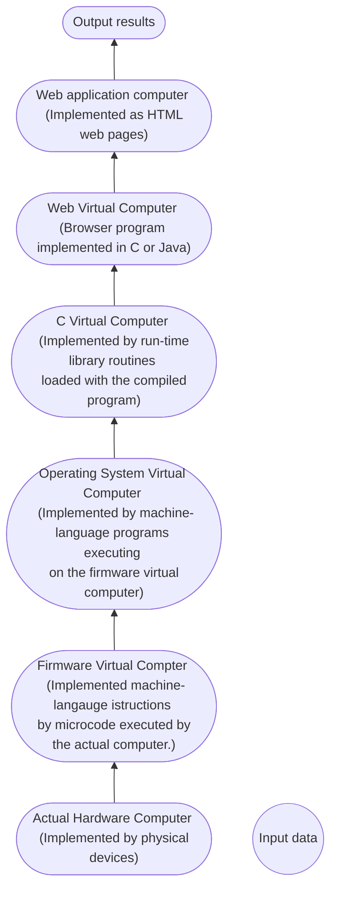

# Virtual Computer

A computer was defined as an integrated set of algorithms and data structures capable of storing and executing programs. We considered ways in which a given computer might actually be construct

1. Hardware Realization : Representing the data structure and algorithms directly with physical devices.
2. Firmware Realization : representing the data structures and algorithms by `microprogramming` a suitable hardware computer.
3. Virtual Machine.
4. Through some combination of these techniques.

#### Example : Layers of Virtual Computer for web application.

