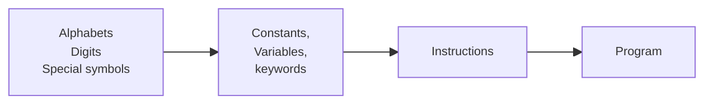

# Topics

## Unit-1: Overview of Computer organization and Programming fundamentals

- Basic Computer Organization
	- Memory
		- Types of Memory
		- Volatile Memory
		- Magnetic Storage
		- Optical Storage
		- Flash Storage

- Evolution of programming languages
- Program Execution
- Data Storage/Representation
	- Text Data Storage
		- The data is store in the computer in shape of bit pattern `0s` and `1s`. 
		- Normally, 8 bits are required to store on character.
		- Unicode or ASCII
	- Numeric Data Storage
		- We use `Binary Notation` to store the numeric values into the computer.
		- We cannot store the Numeric values into the Unicode because it has some issue.
		- We use `Floaitng Point Notaion` to store fractional numbers.
	- Image or Pictures Data Storage
		- Picture or Images are store in computer in form of `Pixel` or `Bit Map`.
	- Sound or Audio Data Storage

- Basics of programming environment
- concept of compiled program
- text editors
- debuggers
- Basic Program Design and Abstractions
- Flow chart and Algorithms
- Syntax and semantics
- Problem representation for Programming

---

## Unit-II: Data Types, Operators and Expressions

### Variables
### Binding

- Binding refers to the process of converting identifiers (such as variable and performance names) into addresses.
- Binding is done for each variable and functions.
- For functions, it means that matching the call with the right function definition by the compiler.
- It takes places either at compile time or at runtime.
	
#### Early Binding (Compile-time time polymorphism)

As the name indicates, compiler (or `linker`) directly associate an address to the function call.

- It replaces the call with a machine language instruction that tells the mainframe to leap to the address of the function.

- By default early binding happens in C++.

#### Late Binding (Run time polymorphism)

- The compiler adds code that identifies the kind of object at runtime then matches the call with the right function definition.
- Late binding is achieved by `Virtual Function`

### Type checking

- scope
- scope rules
- lifetime and garbage collection
- primitive data types
- strings
- array types
- associative arrays
- record types
- union types
- pointers and references
- arithmetic expressions
- type conversions
- relational and boolean expressions
- assignment statements
- mixed mode assignments
- control structures – selection
- iterations
- branching
- guarded statements

---

## Unit-III: Functions and its aspects

- Subprograms and implementations:
	- Subprograms
	- design issues
	- local referencing
	- parameter passing
	- overloaded methods
	- generic methods
	- design issues for functions
	- the semantics of call and return
	- implementing simple subprograms
	- stack and dynamic local variables
	- nested subprograms
	- blocks
	- dynamic scoping

---

## Unit-IV: Object Oriented Concepts

- Object- orientation
- concurrency
- Event handling: 
	- Object – orientation
	- design issues for OOP languages
	- benefits of OOPs
	- implementation of class and object oriented constructs 			 
	- message passing
	- threads 
	- operator overloading
	- exception handling
	- event handling
	- concurrency
	- semaphores
	- Monitors

---

## Unit-V: Functional Language Paradigms

- Introduction to Functional programming languages
- fundamentals of functional programming languages (brief use of Scheme, ML)
- Introduction to logic and logic programming (brief use of Prolog)

---

## Steps in learning C language

- Software Productivity
	- Pressure on software productivity vs. continual reduction in hardware cost.
	- Productivity increases can come from reuse 
	- Abstracts data types (ADTs)for reuse?
	- Mere ADTs are not enough.)

- Polymorphism and dynamic binding.

---

