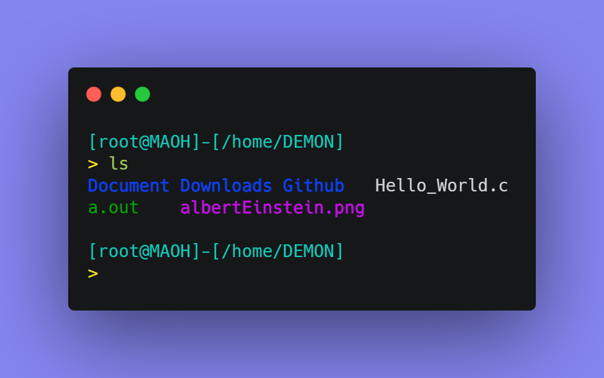
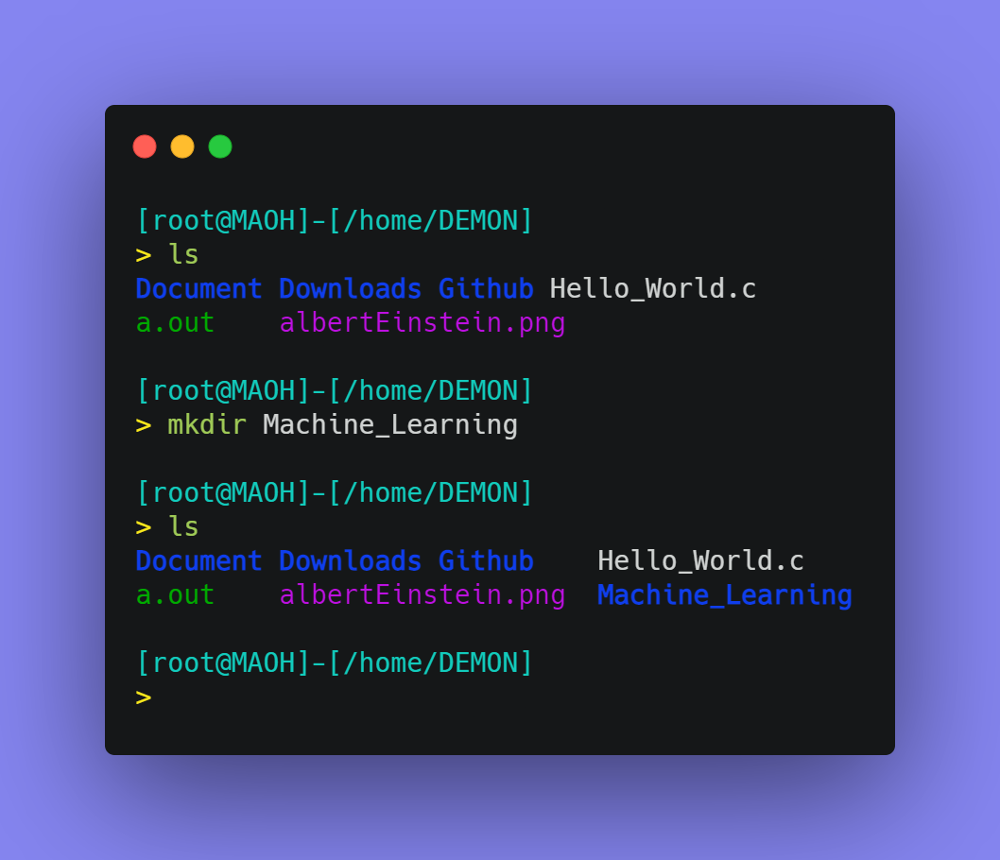
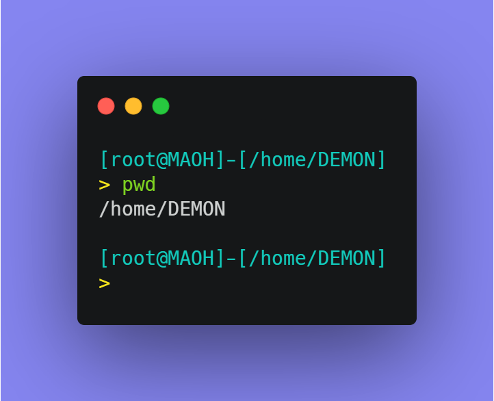
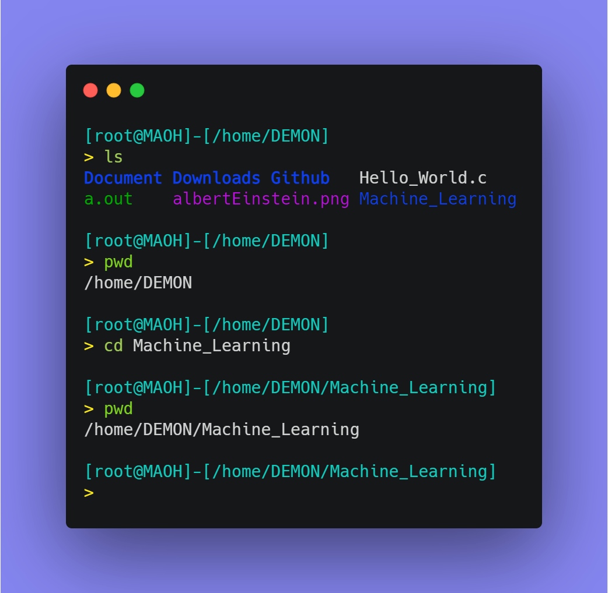
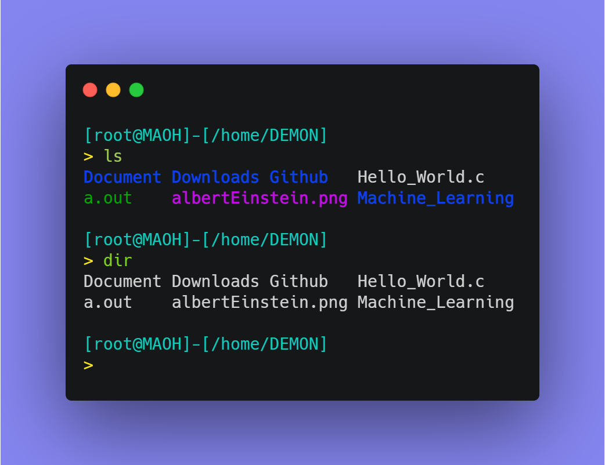
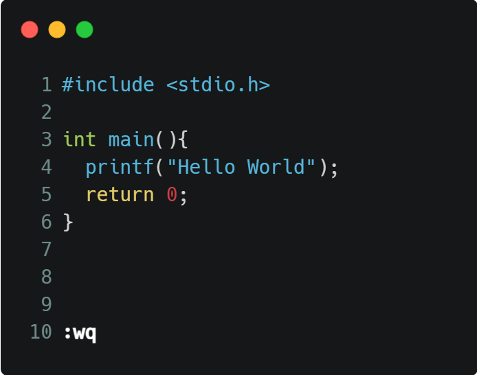

<h5 align="right">November 5, 2021  SAP ID : <code><a href="https://atiq-ur-rehaman.netlify.app/#about" >500097175</a></code> </h5>

## <u>Experiment-1</u> : Linux Commands and C programming Environment

### <u>Objective</u>: To familiarize Linux Commands and demonstrate a clear understanding of the C-programming environment.

### <u>Activity</u> : 1. Study of Linux Commands

#### 

<h4 style="border: 3px; border-color: #6f6fc8; border-style: dashed; padding:10px;"> 1.a] Working with directories : `mkdir`, `rmdir`, `dir`, `pwd`, `cd`, `ls`.</h4>

**<u>Aim</u>** : Understand the following linux command through implementing it.

**<u>Theory</u>**
- `mkdir` : Create an empty directory in the present directory.
	- Syntax : `mkdir Dir_Name`
- `rmdir` : Remove the named directory.
	- Syntax : `rmdir Dir_Name`
- `dir` : list the contents of a directorylist the contents of a directory
	- **dir** command differs from **ls** command in the format of listing contents that is in default listing options.**dir** command differs from **ls** command in the format of listing contents that is in default listing options.
	- Syntax : `dir [options] [File]`
- `cd` : change the current directory.
	- Syntax : `cd <Dir_Name>`
- `pwd` : Display the location of the current working directory.
	- Syntax : `pwd`
- `ls` : Display a list of content of a directory.
	- Syntax : `ls`

**<u>Commands</u>**

- For `ls` command

---

- For `mkdir` command

---

- For  `pwd` command

---

- For `cd` command

---

- For `dir` command

By default, **dir** command lists the files and folders in columns, sorted vertically and special characters are represented by backslash escape sequences. But unlike ls, when the output is on terminal, it does not produce colored output as **ls** does.

---

<h4 style="border: 3px; border-color: #6f6fc8; border-style: dashed; padding:10px;">1.b] Handling Files: `vi`, `gedit`, `more`, `cp`, `mv`, `rm`</h4>

**<u>Aim-b.1</u>** :  Use Vi-Editor to create a `HelloWorld` program in C-Lang.

**<u>Theory</u>**

`Vi`, `Vim - Vi Improved` and `Neovim` has Four main modes : 

1. Command Mode.
2. Insert Mode.
3. Visual Mode.
4. Last-Line Mode.

To open a file in vi-editor
- `vi fileName.txt`

- The default mode in Vi-Editor is `Command Mode`
- Command are `Case-Sensitive`.

1. **_Command Mode_**

To go into command Mode press `Esc`.

Commands :

With respective to Cursor

- `j` : To move cursor downward line.
- `k` : To move cursor upward line.
- `l` : To move cursor left letter.
- `h` : To move cursor right letter.
- `w` : To move cursor next word.
- `b` : To move cursor previous word.
- `$` : To move cursor end of the current line and the cursor will be in command mode.
- `0` : To move cursor start of the current line and the cursor will be in command mode.
- `a` : To move cursor end of the current letter and the cursor will be in insert mode.
- `A` : To move cursor end of the current line and the cursor will be in insert mode.
- `gg` : To move cursor at first line of the file.
- `G` : To move cursor at last line of the file.

With respective `Last-Line Mode`

- `:` : To enter last-line mode.
- `:q` : To close the file in vi-editor.
- `:w` : To save the file.
- `:wq` : To save and close the file.
- `:`

3. **_Insert Mode_**

To enter in Insert Mode from command mode type `i`.

5. **_Visual Mode_**

The Visual mode has three sub-mode:
- Character mode: **v** (lower-case)
- Line mode: **V** (upper-case)
- Block mode: **Ctrl+v**

4. **_Last-Line mode_**: when in Command mode, type a `:` to go into the Last-Line mode.

**<u>Commands</u>**

**<u>Terminal View</u>**

---

**<u>Aim-b.2</u>** : Use the following Linux commands interact with a file.
- `more`, `cp`, `mv` and `rm`.

**<u>Theory</u>**

Commands

- `more` :
- `cp` : 
- `mv` : 
- `rm` : 

