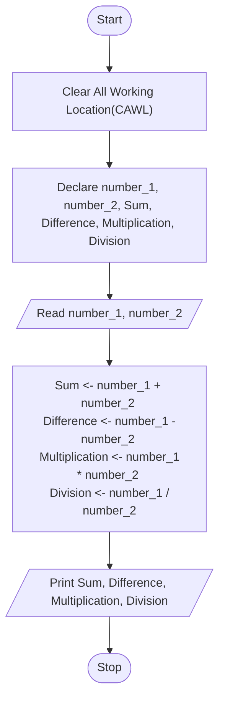

## <u>Experiment-2</u> : Basics of Problem Solving and Program Control Flows


### <u>Objective</u> : To demonstrate use of algorithm and flowchart to design solutions for problems with appropriate selection of program control flow.

### <u>Activity</u> : Identify the suitable program control flow to solve the given problem. Write algorithm, draw flow chart, prepare test cases and test the design for completeness.

<h4 style="border: 3px; border-color: #6f6fc8; border-style: dashed; padding:10px;">1. Given 2 numbers. Calculate sum, difference, multiplication and division.</h4>

**<u>Aim</u>** : Find the sum, difference, multiplication & division of two numbers.

**<u>Theory</u>**:

For sum of two numbers.
- Sum : number_1 + number_2

For difference of two numbers.
- Difference : number_1 - number_2

For multiplication of two numbers.
- Multiplication : number_1 x number_2

For division of two numbers.
- Division : number_1 / number_2

**<u>Algorithm</u>**

```algo
Step-1 : Start
Step-2 : Delcare variable number_1, nubmer_2, Sum, Difference, Multiplication and Division
Step-3 : Read value number_1 and number_2
Step-4 :

	Add number_1, number_2 and assign the result to Sum
		- Sum <-- number_1 + number_2

	Subract number_2 from number_1 and assign the result to Difference
		- Difference <-- number_1 - number_2

	Multiply number_1 with number_2 and assign the result to Multiplication
		- Multiplication <-- number_1 * number_2

	Divide number_1 by number_2 and assign the result to Division
		- Division <-- number_1 / number_2
Step-5 : Display Sum, Difference, Multiplication and Division
Step-5 : Stop
```


**<u>Flowchart</u>**

Defining Variables

- number_1 : first numbers.
- number_2 : second numbers.
- Sum : Summation of two numbers.
- Difference : Difference of two numbers.
- Multiplication : Multiplication of two numbers.
- Division : Division of two numbers.



**<u>Program</u>**

```c
// Pre-processor directive
#include <stdio.h>

int main(){

    // Declaring two int variable
    int number_1;
    int number_2;

    // Declaring the Sum, Difference, Multiplication & Division variable
    int Sum;
    int Difference;
    int Multiplication;
    int Division;


    // Displaying and taking input
    printf("Enter any two interger : ");
    scanf("%d %d", &number_1, &number_2);

    // Defining variable Sum;
    Sum = number_1 + number_2;

    // Defining variable Difference;
    Difference =  number_1 - number_2;

    // Defining variable Multiplication;
    Multiplication = number_1 * number_2;

    // Defining variable Division;
    Division = number_1 / number_2;

    printf(
        "\nSum of two interger : %d \nDifference of two interger : %d \nMultiplication of two interger : %d \nDivision of two interger : %d",
        Sum, Difference, Multiplication, Division
    );
    return 0;

}
```

**<u>Compilation</u>**

Distribution : Debian Linux

OS (Operating System) : Ubuntu \[WSL2\]

File Name : `Experiment-2.1.c`

Compiled File's Folder :  `./Comp_Exec`

```sh
gcc -o ./Comp_Exec/Experiment_2-1 ./Experiment_2-1.c
```

**<u>Input</u>**

```sh
Enter any two interger : 3 4
```

**<u>Output</u>**

```sh
Sum of two interger : 7
Difference of two interger : -1
Multiplication of two interger : 12
Division of two interger : 0
```

---

<h4 style="border: 3px; border-color: #6f6fc8; border-style: dashed; padding:10px;">2. Find if the given number is even or not.</h4>

