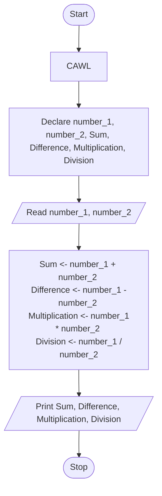
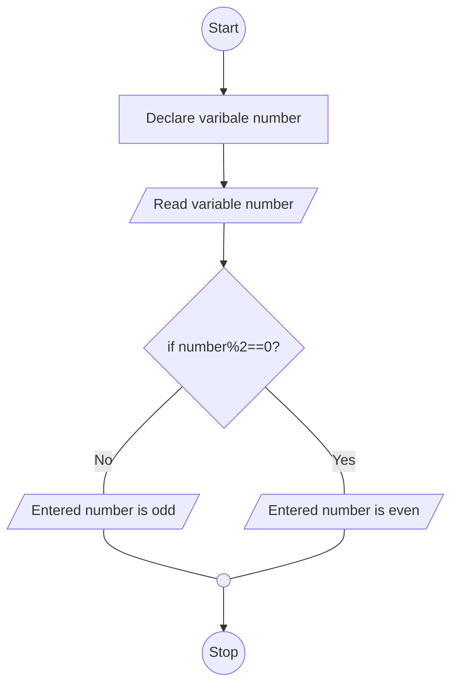
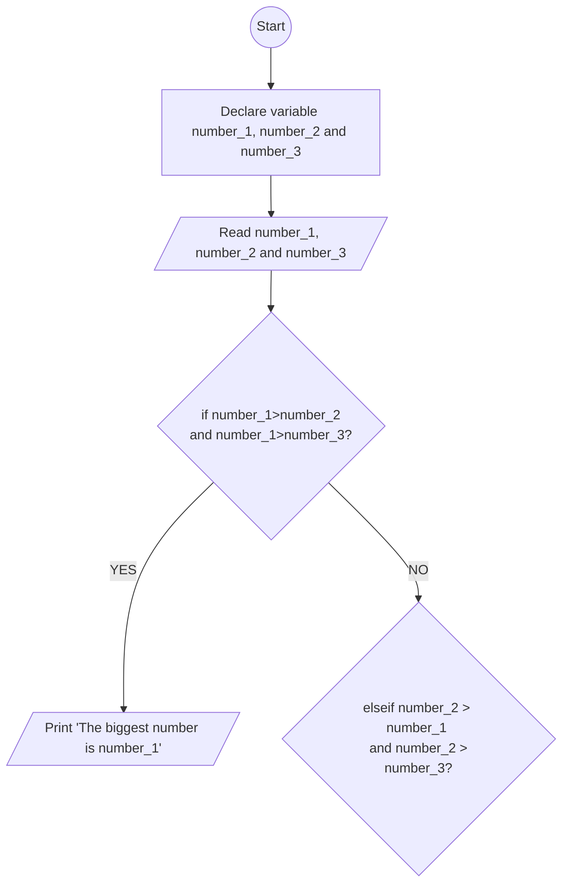

<h5 align="right">November 5, 2021 <br/>SAP ID : <code style="-webkit-user-select: none; -khtml-user-select: none; -moz-user-select: none; -ms-user-select: none; -o-user-select: none; user-select: none;"><a href="https://atiq-ur-rehaman.netlify.app/#about" >500097175</a></code> </h5>

## <u>Experiment-2</u> : Basics of Problem Solving and Program Control Flows
****
### <u>Objective</u> : To demonstrate use of algorithm and flowchart to design solutions for problems with appropriate selection of program control flow.

### <u>Activity</u> : Identify the suitable program control flow to solve the given problem. Write algorithm, draw flow chart, prepare test cases and test the design for completeness.

<h4 style="border: 3px; border-color: #6f6fc8; border-style: dashed; padding:10px;">1. Given two numbers. Calculate sum, difference, multiplication and division.</h4>

**<u>Aim</u>** : Find the sum, difference, multiplication & division of two numbers.

**<u>Theory</u>**:

For sum of two numbers.
- Sum : number_1 + number_2

For difference of two numbers.
- Difference : number_1 - number_2

For multiplication of two numbers.
- Multiplication : number_1 x number_2

For division of two numbers.
- Division : number_1 / number_2

**<u>Algorithm</u>**

```algo
Step-1 : Start
Step-2 : Delcare variable number_1, nubmer_2, Sum, Difference, Multiplication and Division
Step-3 : Read value number_1 and number_2
Step-4 :

	Add number_1, number_2 and assign the result to Sum
		- Sum <-- number_1 + number_2

	Subract number_2 from number_1 and assign the result to Difference
		- Difference <-- number_1 - number_2

	Multiply number_1 with number_2 and assign the result to Multiplication
		- Multiplication <-- number_1 * number_2

	Divide number_1 by number_2 and assign the result to Division
		- Division <-- number_1 / number_2
		
Step-5 : Display Sum, Difference, Multiplication and Division
Step-6 : Stop
```


**<u>Flowchart</u>**

Defining Variables

- `CAWL` : Clear All Working Location
- number_1 : first numbers.
- number_2 : second numbers.
- Sum : Summation of two numbers.
- Difference : Difference of two numbers.
- Multiplication : Multiplication of two numbers.
- Division : Division of two numbers.




**<u>Program</u>**

```c
// Pre-processor directive
#include <stdio.h>

int main(){

    // Declaring two int variable
    int number_1;
    int number_2;

    // Declaring the Sum, Difference, Multiplication & Division variable
    int Sum;
    int Difference;
    int Multiplication;
    int Division;


    // Displaying and taking input
    printf("Enter any two interger : ");
    scanf("%d %d", &number_1, &number_2);

    // Defining variable Sum;
    Sum = number_1 + number_2;

    // Defining variable Difference;
    Difference =  number_1 - number_2;

    // Defining variable Multiplication;
    Multiplication = number_1 * number_2;

    // Defining variable Division;
    Division = number_1 / number_2;

    printf(
        "\nSum of two interger : %d \nDifference of two interger : %d \nMultiplication of two interger : %d \nDivision of two interger : %d",
        Sum, Difference, Multiplication, Division
    );
    return 0;

}
```

**<u>Compilation</u>**

Distribution : Debian Linux

OS (Operating System) : Ubuntu \[WSL2\]

File Name : `Experiment_2-1.c`

Compiled File's Folder :  `./Comp_Exec`

```sh
gcc -o ./Comp_Exec/Experiment_2-1 ./Experiment_2-1.c
```

**<u>Input</u>**

```sh
Enter any two interger : 3 4
```

**<u>Output</u>**

```sh
Sum of two interger : 7
Difference of two interger : -1
Multiplication of two interger : 12
Division of two interger : 0
```

**<u>Terminal view</u>**


---

<h4 style="border: 3px; border-color: #6f6fc8; border-style: dashed; padding:10px;">2. Find if the given number is even or not.</h4>

**<u>Aim</u>**: Find the given number is even or not.

**<u>Theory</u>**

- Even Number: Number that is perfectly divisible by 2.

- Odd Number: Number that is perfectly divisible by 3.


**<u>Algorithm</u>**


```algo
Step-1: Start
Step-2: Declare variable number, even, odd
Step-3: Read number
Step-4:
	- if number/2 gives reminder is zero
		- Diplay number even
	- if number/2 gives reminder is one
		- Diplay number odd
Step-5: Stop
```

**<u>Flowchart</u>**

Defining Variables

- number: number variable.





**<u>Program</u>**

```c
#include <stdio.h>

int main(){

    int number;
    printf("Enter the number: ");

    scanf("%d",&number);
    if (number%2 == 0){
        printf("Number %d is Even.",number);
    }
    else if(number%2 == 1){
        printf("Number %d is Odd", number);
    }

}
```


<h4 style="border: 3px; border-color: #6f6fc8; border-style: dashed; padding:10px;">3. Find the biggest of three numbers.</h4>

**<u>Aim</u>**: Find the biggest of three numbers.

**<u>Algorithm</u>**

```algo
Step-1: Start
Step-2: Declare variable number_1, number_2 and number_3
Step-3: Read number_1, number_2 and number_3
Step-4:

	- IF number_1 > number_2 and number_1 > number_3
		- THEN display "The biggest number is number_1"
	- ELSE-IF number_2 > number_1 and number_2 > number_3
		- THEN dispaly "The biggest number is number_2"
	- ELSE-IF number_3 > number_1 and number_3 > number_1
		- THEN display "The biggest number is number_3"

Step-5: Stop
```

**<u>Flowchart</u>**

- Defining Variable
	- number_1: First number variable.
	- number_2: Second number variable.
	- number_3: Third number variable.



**<u>Program</u>**

```c
#include <stdio.h>

int main(){

    int number_1;
    int number_2;
    int number_3;

    printf("Enter the number: ");
    scanf("%d %d %d", &number_1, &number_2, &number_3);

    if (number_1>number_2 && number_1>number_3){
        printf("The biggest number between %d, %d, %d: %d",number_1,number_2,number_3, number_1);
    }
    else if(number_2>number_1 && number_2>number_3){
        printf("The biggest number between %d, %d, %d: %d",number_1,number_2,number_3, number_2);
    }
    else if(number_3>number_1 && number_3>number_1){
        printf("The biggest number between %d, %d, %d: %d",number_1,number_2,number_3, number_3);
    }

}
```

---

<h4 style="border: 3px; border-color: #6f6fc8; border-style: dashed; padding:10px;">4. Multiply two numbers without using arithmetic multiplication operator (*)</h4>

**<u>Aim</u>**: Multiply two numbers without using arithmetic multiplication operator (*).

**<u>Theory</u>**


**<u>Algorithm</u>**

```algo

Step-1: Start
Step-2:
Step-3:
Step-4:
Step-5:
Step-6: Stop
```


*<u>Flowchart</u>**

**<u>Program</u>**

```c
#include <stdio.h>

int main()
{
    int a;
    int b;
    int c;

    printf("Enter two integer a, b : ");
    scanf("%d %d", &a, &b);

    if (a <= b)
    {
        c = b;
        for (int i = 1; i = a; i++)
            b = c + b;

        printf("Multiplication of  `a` and `b` : %d", b);
    }
    else
    {
        c = a;
        for (int i = 1; i = b; i++)
            a = c + a;

        printf("Multiplication of  `a` and `b` : %d", a);
    }

    return 0;
}
```


---