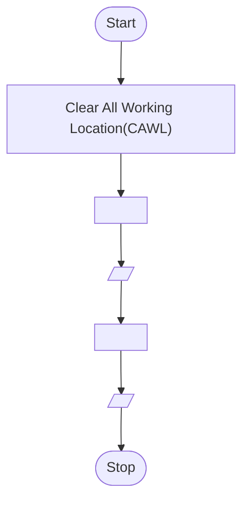

- <h5 align="right">November 8th, 2021<br/>SAP ID : <code style="-webkit-user-select: none; -khtml-user-select: none; -moz-user-select: none; -ms-user-select: none; -o-user-select: none; user-select: none;"><a href="https://atiq-ur-rehaman.netlify.app/#about" >500097175</a></code> </h5>

## <u>Experiment-3</u> : Programming Sequential Logic

### <u>Objective</u>: To code sequential logic in C language

### <u>Activity</u> : Write algorithm and C program, compile, execute and test the code using Linux C compiler with suitable test cases.

<h4 style="border: 3px; border-color: #6f6fc8; border-style: dashed; padding:10px;">1. Obtain the required inputs and compute the areas of the following shapes: (i) Parallelogram (with base and height), (ii) Trapezoid (with height, long base, short base), (iii) Rhombus (with height and side), (iv) Sphere (with radius), (v) Ellipse (with major and minor radius)</h4>


**<u>Aim</u>** : Find the area of `Parallelogram`, `Trapezoid` , `Rhombus`, `Sphere` and `Ellipse`.

**<u>Theory</u>**

**<u>Algorithm</u>**

```algo
Step-1 : Start
Step-2 : Declaring variables parallelogram_area, parallelogram_base, parallelogram_height, trapezoid_area, trapezoid_height, trapezoid_lbase, trapezoid_sbase, rhombus_area, rhombus_diag_1st, rhombus_diag_2nd, sphere_area, sphere_radius, ellipse_area, ellipse_major_radius, ellipse_min_radius
Step-3 : Read parallelogram_base, parallelogram_height,trapezoid_height, trapezoid_lbase, trapezoid_sbase, rhombus_diag_1st, rhombus_diag_2nd, sphere_radius, ellipse_major_radius, ellipse_min_radius
Step-4 : 

	Multiply parallelogram_base, parallelogram_height and assign the result to parallelogram_area
	- parallelogram_area <-- parallelogram_height * parallelogram_base
	
	Add trapezoid_lbase, trapezoid_sbase and divide the sum of both by 2 and multiply with trapezoid_height and assign the result to trapezoid_area
	- trapezoid_area <-- ((trapezoid_sbase * trapezoid_lbase) /2 ) * trapezoid_height
	
	Multiply rhombus_diag_1st with rhombus_diag_2nd and divide the whole thing by 2 and assign the result to rhombus_area
	- rhombus_area <-- (rhombus_diag_1st * rhombus_diag_2nd) / 2
	
	Multiply sphere_radius, sphere_radius, $4 \pi$ and assign the result to sphere_area
	- sphere_area <-- sphere_radius * sphere_radius * $4\pi$
	
	Multiply ellipse_major_radius, ellipse_min_radius, $\pi$ and assign the result to ellipse_area
	
Step-5 : Display parallelogram_area, trapezoid_area, rhombus_area, sphere_area and ellipse_area
Step-6 : Stop
```


**<u>Flowchart</u>**

Defining Variables


**<u>Program</u>**

```c
// Pre-processor directive
#include <stdio.h>

int main(){

    // parallelogram
    float parallelogram_area;
    float parallelogram_base;
    float parallelogram_height;


    printf("Enter parallelogram base and height : ");
    scanf("%f %f", &parallelogram_base, &parallelogram_height);

    parallelogram_area = parallelogram_base * parallelogram_height;

    // trapezoid
    float trapezoid_area;
    float trapezoid_height;
    float trapezoid_sbase;
    float trapezoid_lbase;

    printf("Enter trapezoid height, short base and long base : ");
    scanf("%f %f %f", &trapezoid_height, &trapezoid_sbase, &trapezoid_lbase);

    trapezoid_area = ((trapezoid_sbase + trapezoid_lbase )/2) * (trapezoid_height);

    // Rhombus
    float rhombus_area;
    float rhombus_diag_1st;
    float rhombus_diag_2nd;

    printf("Enter rhombus 1st diagonal and 2nd diagonal values : ");
    scanf("%f %f", &rhombus_diag_1st, &rhombus_diag_2nd);

    rhombus_area = (rhombus_diag_1st * rhombus_diag_2nd) / 2;

    // Sphere
    float sphere_area;
    float sphere_radius;

    printf("Enter sphere radius : ");
    scanf("%f", &sphere_radius);

    sphere_area = sphere_radius * sphere_radius * 4 * 3.14; // approx pi value been considered.

    // Ellipse
    float ellipse_area;
    float ellipse_min_radius;
    float ellipse_major_radius;

    printf("Enter Ellipse minor and major size of radius : ");
    scanf("%f %f", &ellipse_min_radius, &ellipse_major_radius);

    ellipse_area = 3.14 * ellipse_min_radius * ellipse_major_radius;

    printf(
        "\nArea of Parallelogram : %f \nArea of Trapezoid : %f \nArea of Rhombus : %f \nArea of Sphere : %f \nArea of Ellipse : %f",
        parallelogram_area, trapezoid_area, rhombus_area, sphere_area, ellipse_area
    );

    return 0;

}
```

**<u>Compilation</u>**

Distribution : Debian Linux

OS (Operating System) : Ubuntu \[WSL2\]

File Name : ` `

Compiled File's Folder :  `./Comp_Exec`

```sh
gcc -o ./Comp_Exec/ 
```

**<u>Input</u>**

```sh
```

**<u>Output</u>**

```sh
```

**<u>Terminal view</u>**


---

<h4 style="border: 3px; border-color: #6f6fc8; border-style: dashed; padding:10px;">2. Given two numbers. Demonstrate the swapping of the values (i) using a third variable (ii) without using a third variable</h4>


**<u>Aim-i</u>** : Swapping of the integer values using a third variable.

**<u>Theory</u>**

**<u>Algorithm</u>**

```algo
Step-1 : Start
Step-2 : Declaring variables number_1, number_2, number_3
Step-3 : Read number_1, number_2
Step-4 : 

	Assign number_1 to number_3
	- number_3 <-- number_1
	
	Assing number_2 to number_1
	- number_1 <-- number_2
	
	Assing number_3 to number_2
	- number_2 <-- number_3
	
Step-5 : Display number_1 and number_2
Step-6 : Stop

```

**<u>Flowchart</u>**

Defining Variables


**<u>Program</u>**

**<u>Compilation</u>**

Distribution : Debian Linux

OS (Operating System) : Ubuntu [WSL2]

File Name :

Compiled File's Folder : `./Comp_Exec`

```sh
gcc -o ./Comp_Exec/ 
```

**<u>Input</u>**

**<u>Output</u>**

**<u>Terminal view</u>**


---

**<u>Aim-ii</u>** : Swapping of the integer values without using a third variable.

**<u>Theory</u>**

**<u>Algorithm</u>**

```algo
Step-1 : Start
Step-2 : Declaring variables number_1, number_2
Step-3 : Read number_1, number_2
Step-4 : 

	Add number_1, number_2 and assign the result to number_1
	- number_1 <-- number_1 + number_2
	
	Substract number_2 with number_1 and assign the result to number_2
	- number_2 <-- number_1 - number_2
	
	Subtract number_2 with number_1 and assign the result to number_1
	- number_1 <-- number_1 - number_2
	
Step-5 : Display number_1 and number_2
Step-6 : Stop

```

**<u>Flowchart</u>**

Defining Variables


**<u>Program</u>**

**<u>Compilation</u>**

Distribution : Debian Linux

OS (Operating System) : Ubuntu [WSL2]

File Name :

Compiled File's Folder : `./Comp_Exec`

```sh
gcc -o ./Comp_Exec/ 
```

**<u>Input</u>**

**<u>Output</u>**

**<u>Terminal view</u>**


---

<h4 style="border: 3px; border-color: #6f6fc8; border-style: dashed; padding:10px;">4. Print the given days in years-month-days format. </h4>


**<u>Aim-i</u>** : Swapping of the integer values using a third variable.

**<u>Theory</u>**

**<u>Algorithm</u>**

```algo
Step-1 : Start
Step-2 : Declaring variables number_1, number_2, number_3
Step-3 : Read number_1, number_2
Step-4 : 

	Assign number_1 to number_3
	- number_3 <-- number_1
	
	Assing number_2 to number_1
	- number_1 <-- number_2
	
	Assing number_3 to number_2
	- number_2 <-- number_3
	
Step-5 : Display number_1 and number_2
Step-6 : Stop

```

**<u>Flowchart</u>**

Defining Variables




**<u>Program</u>**

```c
#include <stdio.h>

// year is consider for 365 days.
int main(){

    int days;

    printf("Enter number of days : ");
    scanf("%d", &days);

    printf("Calender format : %d year - %d month - %d days", (days/365), (days%365)/30, ((days%365)%30));

    return 0;
}
```

**<u>Compilation</u>**

Distribution : Debian Linux

OS (Operating System) : Ubuntu [WSL2]

File Name :

Compiled File's Folder : `./Comp_Exec`

```sh
gcc -o ./Comp_Exec/ 
```

**<u>Input</u>**

**<u>Output</u>**

**<u>Terminal view</u>**


---


