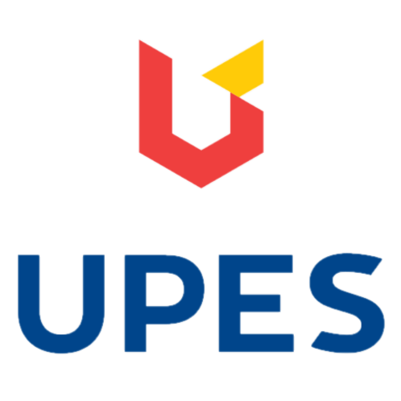

<h1 align="center"><b>University of Petroleum &amp; Energy Studies</b></h1>

<h2 align="center"><b>LAB MANUAL</b></h2>
<h3 align="center"><b>B. Tech</b></h3>
<h3 align="center"><b>Computer Science &amp; Engineering</b></h3>

<h3 align="center"><b>LAB: Principle of Programming Language</b></h3>
 

<h3 align="center"><b>Name: Atiq Ur-Rehaman</b></h3>
<h3 align="center"><b>Batch: BT-CSE-I-B43</b></h3>
<h3 align="center"><b>SAP ID: 500097175</b></h3>

 
 
<h4 align="center"><b><u>Faculty Name</u></b></h4>
<h4 align="center"><b><a href="https://scholar.google.co.in/citations?user=1mRY0ZkAAAAJ&hl=en" target="_blank">Deepika Koundal</a></b></h4>

