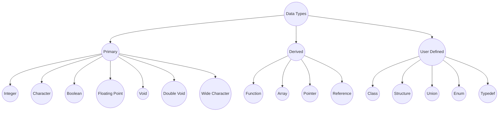

- Who introduce C++?
	- Bjarne Stroustrup

- When C++ is invented?

	- C++ programming language was invented in year 1979.

- Application of C++

	- In Designing PC (Personal Computer) or Mobile Games
	- In Operating Systems
		- Majors parts of all widely used operating systems are written in C and C++
	- In Web Browsers
		- Majors parts of all widely used Web browsers are written in C and C++
		- Examples:
			- Google Chrome
			- Microsoft Edge
			- Mozilla FireFox
			- Opera
			- Safari
	- In GUI(Graphical User Interface) and Editors
		- Examples
			- Adobe Photoshop
			- Notepad
			- MS office
			- Adobe Reader 
	- In Database Management Software
		- Example
			- Oracle Database
			- IBM DB2
			- MongoDB
			- MySQL
	- For Creating other Programming Language
		- Most part of Java language is written in C++.

	- In many engineering applications
		-   AutoCad
		-   MatLab Simulink (Electrical)
		-   AutoDesk (3D Animation)

	- In multimedia players
		- WinAmp
		- VLC Media Player
		- Window Media Player

	- In Language Translators
		- Compilers: Convert High Level Language Source code to machine language in one go such as C, C++ Java etc.
		- Interpreters: Convert High Level language source code to Machine language line by line such as Python.
		- Assemblers: Convert Assembly language code to Machine Language in on go.
	- In Device Driver
	- In Network Protocols
		- Maximum network protocols such as: http, https, IPv4, IPv6, FTP, TCP, UDP etc. Are written in C and C++.
	- In creating Viruses & Anti-Viruses
	- In Robotics, Embedded Systems & Iot(Internet Of Things)
	- Electronic Applications Software.
- C++ Structure
	- Header File declaration Section.
	- Global Declarations(if any)
	- Namespace
	- Main Function
	- Statements & Expressions
	- User Defined Functions(UDF)
	- Comments
- Pre-Processor
- Pre-Processor Directive
- Processor
- Keywords

