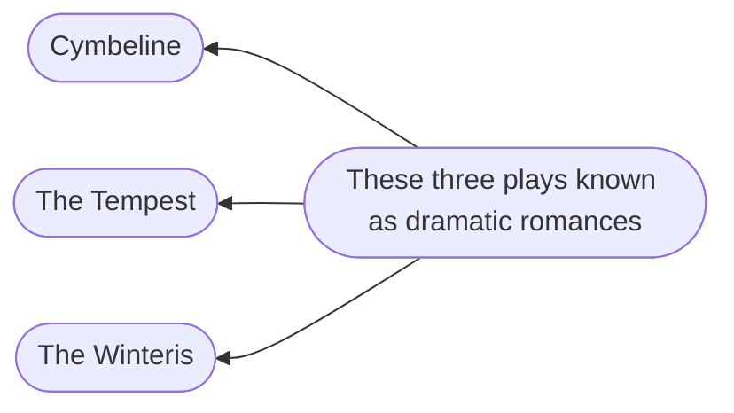
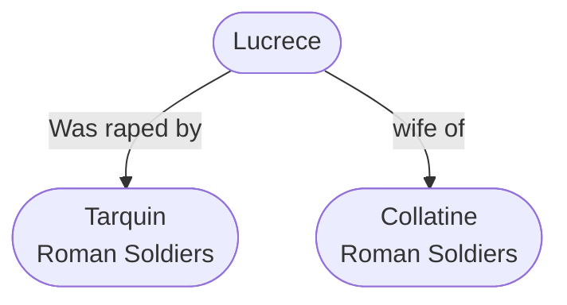

<h1 align="center">William Shakespeare</h1>
<h6 align="center">1564 - 1616</h6>
<h6 align="center">England's National Poet</h6>

## About Him

- Was born on or about `April 23, 1564` at <u>Stratford Upon - Avon</u>.
- **Ben Jonson** remarks about Shakespeare that he knows "Small Latin Less Greek".
- He used 15,000 words, wrote pure English.
- At the age of 18, married to `Anne Hathaway`.
- In 1586 or 87 Shakespeare left his native town and came to London. At his time university wits had renovated English drama.
- In 1592 `Greene` mentioned him as "Upstart Crow".
- He purchased property in Stratford and London and became a shareholder in the `Globe` and `Blackfriars`.
- He stayed in London for about 20 years. About 1610 Shakespeare left London for Stratford.
- Shakespeare died on `April 23, 1616`.
- He was not just a dramatist, he was theater owner, actor, playwright.

## Shakespeare Works

||||
|:-:|:-:|:-:|
|01|Sonnets|154|
|02|History plays|4|
|03|Long Poems|4|
|04|Comedies|17|
|05|Tragedy|11|

## The First Period (1588 - 1596)

- " Titus Andronicus "
- " The First Part of Henry VI "
- " Love's Labour Lost " (Shows the influence of Lyly)
- " The Comedy of Error "
- " The The Gentleman of Verona " ( Sentimental Romance )
- " A Midsummer Night Dream " ( Romance )
- " Romeo and Juliet "(1592) \[First Love Tragedy]
-  Under the influence of 	`Marlowe` and `Peele`, he began his great series of historical plays:
	-  "Richard II".
	-  "Richard III" (1593)
-  " King John " (1596)
-  Early verse:
	-  " The Rape of Lucrece "
	-  " Venus and Adonis "
	-  

## The Second Period (1596 - 1600)

It is a period of great rapid growth and development (Shakespeare wrote `great comedies` and `chronical plays` during this period)

- "The Merchant Of Venice" in which Shakespeare attained mastery over his art.
- "The Taming of Shrew" a pure comedy full of wit.
- "The Merry Wives of Windsor" fine comedy.
- Trial of famous love comedies:
	- "Much Ado About Nothing"
	- "As You Like It" or "What You Will"
	- "The Twelfth Night"
- "Henry IV, Part I and II"
- "Henry V"

## The Third Period (1601 - 1608)

It is a period of Shakespeare's supreme masterpiece.

###### Great Tragedies:

- "Hamlet"
- "King Lear"
- "Julius Ceasar"
- "Macbeth"
- "Othello"

###### Bitter and Sombre Comedies:

- " All Well That Ends Well "
- " Measure For Measure "
- " Troilus and Cressida "

## The Fourth Period (1608 - 1613)

This period opens with "Antony and Cleopatra" (Love Tragedy)

- " Coriolanus "
- " Timon of Athens "
- " Henry VIII "
- " Pericles "

In $IV^{th}$ period we can see the influence of `Beaumont` and `Fletcher`. This period is the reawakening of his first love romance in

#### Long Narrative Poem

- "Venus and Adonis" (1593) \[First Publication]
- "The Rape of Lucrece" (1594) \[Narrative Poem]
- These works were written during theatre was closed (Due to plague it was closed from 1592 to 1594)

###### Short Point on "Venus and Adonis"

- Venus tries to seduce Adonis and Adonis is not interested in her and wants to go for hunting.

- "Venus and Adonis" dedicated to Henry $3^{rd}$ Earl of Southamption. (Who was his patrons)

###### Short Points on "The Rape of Lucrece"

- "The Rape of Lucrece" (1594) addressed to Earl of Southampton

## Historical Plays

- Henry $IV$ part $I$
- Henry $IV$ part $II$
- Henry $V$
- Henry $VI$ part $I$
- Henry $VI$ part $II$
- Henry $VI$ part $III$
- Henry $VIII \hspace{3mm} \rightarrow \hspace{1mm}$ This was completed by `Fletcher`.
- King John.
- Richard $II$
- Richard $III$
