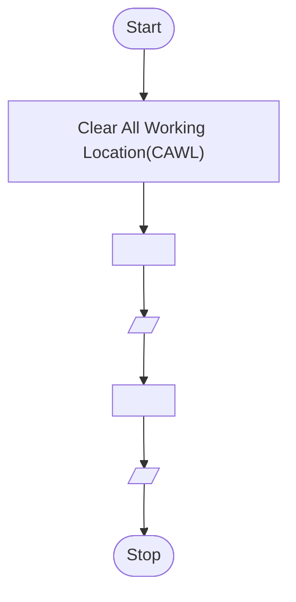

<h5 align="right"><% tp.file.creation_date("MMMM Do, YYYY") %><br/>SAP ID : <code style="-webkit-user-select: none; -khtml-user-select: none; -moz-user-select: none; -ms-user-select: none; -o-user-select: none; user-select: none;"><a href="https://atiq-ur-rehaman.netlify.app/#about" >500097175</a></code> </h5>

## <u><% tp.file.title%></u> : 

### <u>Objective</u>:

### <u>Activity</u> : 

<h4 style="border: 3px; border-color: #6f6fc8; border-style: dashed; padding:10px;"></h4>


**<u>Aim</u>** : 

**<u>Theory</u>**

**<u>Algorithm</u>**

```algo
Step-1 : Start
Step-2 : 
Step-3 : 
Step-4 :
Step-5 : 
Step-6 : Stop
```


**<u>Flowchart</u>**

Defining Variables




**<u>Program</u>**

```c
// Pre-processor directive
#include <stdio.h>

int main(){

    return 0;

}
```

**<u>Compilation</u>**

Distribution : Debian Linux

OS (Operating System) : Ubuntu \[WSL2\]

File Name : ` `

Compiled File's Folder :  `./Comp_Exec`

```sh
gcc -o ./Comp_Exec/ 
```

**<u>Input</u>**

```sh
```

**<u>Output</u>**

```sh
```

**<u>Terminal view</u>**


---

